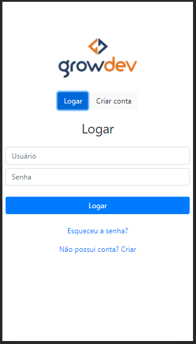

# responsive-login-signup-form

## 💻 Project

As part of the bootcamp program that I'm taking part at the moment ([Growdev Starter](https://www.growdev.com.br/starter)), I've created this responsive interface using Bootstrap.

The idea was to practice the frontend development workflow of a single interface, one that could be used as part of a larger project.

## 🚀 Stack

This project uses the following technologies:

- [HTML](https://github.com/topics/html)
- [CSS](https://github.com/topics/css)
- [Bootstrap](https://github.com/topics/bootstrap)
- [JS](https://github.com/topics/js)

## :construction: Improvement ideas

- Responsiveness, specially fields and buttons width.
- Include actions into "Forgot Password?" link.
- Include actions into "Don't have an account?" and "Already have an account?" links.
- English version.

## :v: Greetings

Development workflow was based in Adrian Twarog's ["Login Form HTML CSS | Bootstrap 5" tutorial"](https://www.youtube.com/watch?v=3ENJ_xd625s&ab_channel=AdrianTwarog). The inspiration for a combinbed Login and Signup form came from [this](https://codepen.io/j9159573241/pen/rNNvZRy) Codepen project.